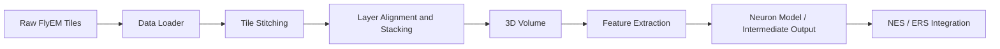
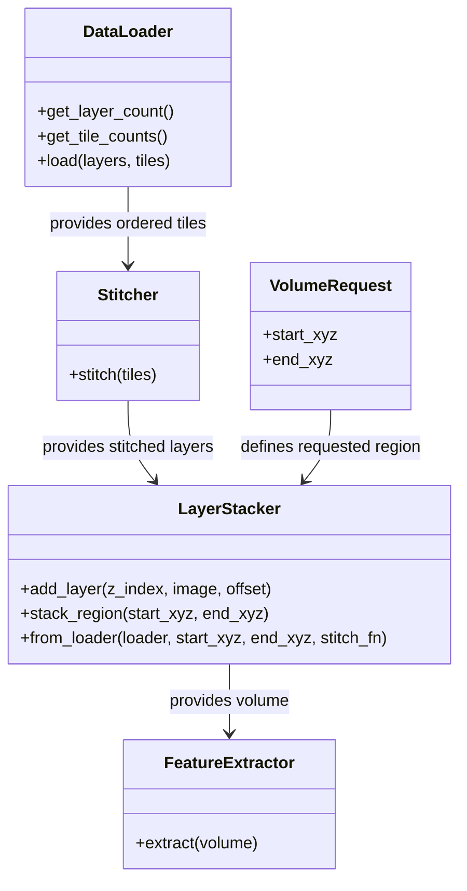

# STS Milestone-Driven Architecture

This note turns the current STS milestones into a concrete overview diagram and a first-pass class/module map.

## Design Goals

- Keep data loading, stitching, stacking, and feature extraction as separate responsibilities.
- Favor loose coupling so one stitching or analysis backend can be replaced without rewriting the whole pipeline.
- Keep high cohesion by letting each module own one stage of the pipeline and one kind of state.

## Milestones

1. Dataset discovery and loading
2. Tile stitching within each layer
3. Layer alignment and 3D volume assembly
4. Feature extraction from the assembled volume
5. Export or handoff into downstream BrainGenix systems

## Overview Diagram

## Module and Class Candidates

| Milestone | Responsibility | Current or Candidate Module |
| --- | --- | --- |
| Dataset discovery and loading | Enumerate layers and tiles, validate ranges, return ordered tiles | `Sandbox/LoadNeuronData/DataLoader.py`, future `Source/Core/Loader/...` loader module |
| Tile stitching | Combine overlapping tiles into one stitched layer image | `Sandbox/Stitch/stitching.py`, future stitching service abstraction |
| Layer alignment and stacking | Register stitched layers in XY/Z space and extract requested sub-volumes | `Sandbox/Stitch/LayerStacker.py` |
| 3D volume handoff | Provide a stable in-memory representation of the requested volume | candidate `VolumeAssembler` or `VolumeRequest` structure |
| Feature extraction | Run morphology and derived measurements on the assembled volume | `Source/Core/NeuronFeatureExtraction/STS_NeuronCapacitanceExtraction/...` |
| System integration | Share output with the rest of BrainGenix, plus config/logging | `STS_STRUCT_SystemUtils`, configuration loader, logging system |

## Relationship Notes

- The data loader should not know how stitching is implemented.
- The stitching stage should operate on tile collections and return stitched layers.
- The stacking stage should accept stitched layers plus offsets and return a requested XYZ crop or volume.
- Feature extraction should work from the assembled volume rather than from raw tile layout details.
- Export and downstream integration should depend on stable intermediate data structures rather than on sandbox-only scripts.

## First-Pass Class Diagram

## Follow-On Work

- Use this note as the basis for `BrainGenix-STS#6`, where the repo structure and work items can be divided by module.
- Convert the candidate modules into class or package templates only after the intended interfaces stabilize.
