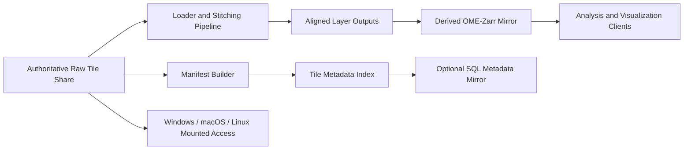

<!-- markdownlint-disable MD013 MD034 MD043 -->

# STS Remote Data Hosting Plan

This note converts the FlyEM hosting problem into a reviewable plan that can later be split into implementation and infrastructure tasks.

## Requirements From The Issue

- avoid downloading the full dataset to every workstation
- provide mount-like access for Windows, macOS, and Linux users
- preserve raw or near-raw tile data rather than forcing an early database-only representation
- retain tile coordinate metadata, including X, Y, and Z ranges
- allow automation if metadata is later mirrored into a database

## Recommendation

Use a two-layer storage model:

1. **Authoritative raw tile store:** a shared network file system namespace, exposed as a mounted share for day-to-day access.
2. **Derived metadata and analysis stores:** generated artifacts that index, align, or reformat the raw tiles without replacing them as the source of truth.

This keeps the issue's "treat it like local storage" requirement separate from the later "structured access" requirement.

## Recommended Architecture

## Layer 1: Authoritative Raw Tile Store

Recommended role:

- keep the original tile files in a mounted network share
- organize the directory tree so layer and tile identity can be derived deterministically
- make the share read-mostly for users and write-controlled for ingest jobs

Why this is the best first step:

- the issue explicitly asks for a network location that behaves like local storage
- SMB is designed for remote file access and includes security, performance, and availability features for file sharing workloads
- this keeps the raw data accessible before a richer indexing or analysis format is fully defined

Practical guidance:

- treat this share as the source of truth
- keep file naming and directory naming stable enough for deterministic loader logic
- do not depend on a database for basic tile reads

## Layer 2: Tile Metadata Index

Store a generated manifest alongside the raw share.

Each row should include:

- stable tile identifier
- original relative path
- layer or `z_index`
- tile-local dimensions
- global coordinate bounds such as `x_min`, `x_max`, `y_min`, `y_max`, `z_index`
- alignment or stitching status
- checksum or last-seen ingest timestamp

This manifest can begin as a flat file or lightweight table and later be mirrored into SQL without changing the raw-store contract.

## Optional SQL Mirror

If the project later needs richer querying, use SQL as a metadata index rather than as the primary image store.

Recommended SQL scope:

- tile and layer identifiers
- coordinate ranges
- derived alignment status
- provenance, checksums, and pipeline bookkeeping

Do **not** require SQL just to open the raw tile files. The raw share should remain usable even if the SQL mirror is unavailable.

## Derived Analysis Store

Once tiles and layers are aligned, export a derived analysis-ready representation instead of rewriting the authoritative raw store.

Recommended role for OME-Zarr or Zarr-based derived outputs:

- store aligned or multiscale volumes for downstream analysis
- preserve explicit coordinate-transform metadata
- support remote or object-backed access patterns when analysis no longer needs raw mounted files

Why this is useful:

- OME-Zarr supports multiresolution image filesets and coordinate transformations
- Zarr supports both local stores and remote/object-backed stores
- this makes it easier to expose aligned volumes to analysis tools without forcing the raw tile tree to change

## Decision Table

| Option | Strengths | Weaknesses | Recommended Role |
| --- | --- | --- | --- |
| Mounted SMB share | best match for mount-like workstation access; preserves raw files directly | needs access-control and operational setup | primary raw store |
| SQL-only image storage | strong query model | poor fit for mount-like raw access; adds ingest dependency too early | not recommended as first system |
| OME-Zarr derived mirror | supports multiscale data and coordinate-aware metadata | not the same as a mounted raw share | derived aligned-analysis store |
| Flat manifest plus raw share | simple and reviewable | limited query flexibility compared to SQL | first metadata layer |

## Implementation Phases

1. Stand up a mounted raw share for pilot users.
2. Define the canonical directory and naming convention for layers and tiles.
3. Generate a manifest file with coordinate bounds and tile metadata.
4. Update the STS loader to consume the manifest when available, while still understanding the raw share layout.
5. Add an optional SQL mirror for metadata-only queries.
6. Export aligned outputs into a derived OME-Zarr or Zarr-based store once stitching and stacking are stable.

## Validation Checklist

- can Windows, macOS, and Linux users mount the same namespace successfully?
- can the current sandbox loader read the mounted path without copying data locally?
- can the manifest regenerate from raw files without manual edits?
- can the metadata layer retain X/Y/Z bounds for every tile?
- can aligned outputs be regenerated without mutating the raw source of truth?

## Follow-On Issues To Split Out

- choose and provision the mounted share technology
- define the canonical raw directory layout
- generate the tile manifest
- mirror manifest data into SQL if needed
- export aligned outputs into a derived OME-Zarr store
- add loader support for manifest-aware remote datasets

## Sources

- Microsoft SMB overview: https://learn.microsoft.com/en-us/windows-server/storage/file-server/file-server-smb-overview
- Zarr storage guide: https://zarr.readthedocs.io/en/main/user-guide/storage/
- OME-Zarr documentation: https://ome-zarr.readthedocs.io/en/latest/
- OME-Zarr format API: https://ome-zarr.readthedocs.io/en/stable/api/format.html
- OME-Zarr writer API: https://ome-zarr.readthedocs.io/en/latest/api/writer.html
